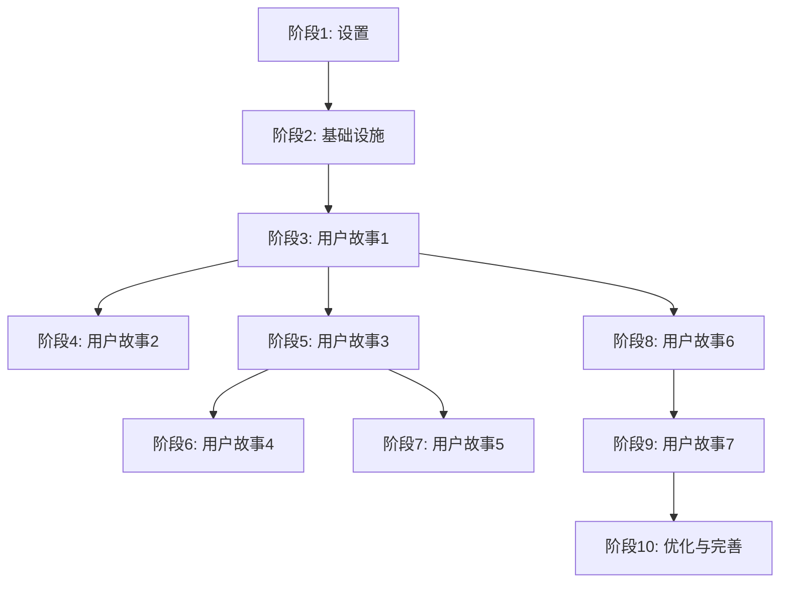

# 任务: Tools 管理

## 阶段 1: 设置

- [ ] T001 创建 API 服务层目录结构 services/
- [ ] T002 [P] 扩展 types.ts 中的工具相关类型定义
- [ ] T003 [P] 创建确认对话框组件 components/ui/ConfirmDialog.tsx

## 阶段 2: 基础设施

- [ ] T004 实现 API 服务层 services/toolsApi.ts
- [ ] T005 [P] 实现数据验证工具 services/validation.ts
- [ ] T006 [P] 创建自定义 hooks 用于工具管理状态

## 阶段 3: 用户故事 1 - 查看工具列表 (P1)

**目标**: 用户能够查看当前系统中所有可用的工具
**独立测试**: 用户可以从 Agent 管理页面点击 "Tools 管理" 按钮，进入工具管理页面，查看所有已配置的工具列表

- [ ] T007 [US1] 增强 ToolManagement 组件的工具列表显示功能 components/ToolManagement.tsx
- [ ] T008 [US1] 实现工具列表数据获取和状态管理
- [ ] T009 [US1] 优化工具类型样式映射和图标显示
- [ ] T010 [US1] 实现空状态提示显示逻辑

## 阶段 4: 用户故事 2 - 搜索和筛选工具 (P1)

**目标**: 用户能够搜索和筛选工具，快速找到特定工具
**独立测试**: 用户可以在工具管理页面的搜索框中输入关键词，系统实时筛选显示匹配的工具

- [ ] T011 [US2] 实现实时搜索功能和防抖优化 components/ToolManagement.tsx
- [ ] T012 [US2] 优化搜索结果显示和空结果处理
- [ ] T013 [US2] 实现搜索框清空和重置功能

## 阶段 5: 用户故事 3 - 添加新工具 (P1)

**目标**: 用户能够添加新的工具到系统中
**独立测试**: 用户可以点击 "Provision tool" 按钮，填写工具信息并保存，新工具应出现在工具列表中

- [ ] T014 [US3] 增强工具创建表单模态框 components/ToolManagement.tsx
- [ ] T015 [US3] 实现客户端数据验证和错误显示
- [ ] T016 [US3] 实现工具名称唯一性验证
- [ ] T017 [US3] 集成创建工具 API 调用和错误处理
- [ ] T018 [US3] 实现创建成功后的列表更新

## 阶段 6: 用户故事 4 - 编辑工具信息 (P2)

**目标**: 用户能够修改现有工具的信息
**独立测试**: 用户可以点击工具的编辑按钮，修改工具信息并保存，更改应反映在工具列表中

- [ ] T019 [US4] 实现编辑模式的表单预填充功能 components/ToolManagement.tsx
- [ ] T020 [US4] 实现编辑时的名称唯一性验证（排除当前工具）
- [ ] T021 [US4] 集成更新工具 API 调用和错误处理
- [ ] T022 [US4] 实现更新成功后的列表刷新

## 阶段 7: 用户故事 5 - 删除工具 (P2)

**目标**: 用户能够删除不再需要的工具
**独立测试**: 用户可以点击工具的删除按钮，确认删除后，工具应从列表中移除

- [ ] T023 [US5] 实现删除确认对话框 components/ui/ConfirmDialog.tsx
- [ ] T024 [US5] 实现工具使用状态检查功能
- [ ] T025 [US5] 实现使用中工具的警告对话框
- [ ] T026 [US5] 集成删除工具 API 调用和错误处理
- [ ] T027 [US5] 实现删除成功后的列表更新

## 阶段 8: 用户故事 6 - 切换视图模式 (P3)

**目标**: 用户能够在列表视图和卡片视图之间切换
**独立测试**: 用户可以点击视图切换按钮，在列表视图和卡片视图之间切换

- [ ] T028 [US6] 优化视图模式切换逻辑 components/ToolManagement.tsx
- [ ] T029 [US6] 确保视图切换时数据正确显示
- [ ] T030 [US6] 实现视图按钮的激活状态显示

## 阶段 9: 用户故事 7 - 分页浏览工具 (P3)

**目标**: 用户能够分页浏览工具列表，提高性能和体验
**独立测试**: 当工具数量超过每页显示限制时，用户可以使用分页控件浏览不同页面的工具

- [ ] T031 [US7] 实现视图模式相关的动态分页大小 components/ToolManagement.tsx
- [ ] T032 [US7] 优化分页控件显示和交互
- [ ] T033 [US7] 实现分页信息显示（当前页/总页数）
- [ ] T034 [US7] 确保视图切换时分页状态正确更新

## 阶段 10: 优化与完善

- [ ] T035 实现长文本省略号和悬停提示功能 components/ToolManagement.tsx
- [ ] T036 [P] 优化错误处理和用户反馈机制
- [ ] T037 [P] 实现响应式设计优化
- [ ] T038 [P] 性能优化：防抖、虚拟化等
- [ ] T039 添加加载状态和骨架屏

## 依赖关系

## 并行执行

### 阶段 1 内
T002, T003 可以并行执行（不同文件）

### 阶段 2 内
T005, T006 可以并行执行（不同文件）
T004 依赖 T002 完成

### 阶段 10 内
T036, T037, T038 可以并行执行（不同关注点）

## 实现策略

- **MVP 范围**: 完成阶段 3-5 (用户故事 1-3) 提供最小可行产品
- **增量交付**: 每个用户故事阶段都可以独立测试
- **性能优先**: 阶段 3-5 完成后即可满足基本性能要求
- **体验增强**: 阶段 6-10 专注于用户体验优化

## 验证检查点

### 阶段 3 完成后
- [ ] 工具列表正确加载和显示
- [ ] 空状态正确处理
- [ ] 基本错误处理工作正常

### 阶段 5 完成后 (MVP)
- [ ] 完整的 CRUD 操作功能
- [ ] 搜索功能正常工作
- [ ] 数据验证和错误处理完整
- [ ] 性能满足基本要求

### 阶段 7 完成后
- [ ] 所有核心功能完整
- [ ] 用户体验良好
- [ ] 错误处理健壮

### 最终完成后
- [ ] 所有用户故事验收场景通过
- [ ] 性能指标达标
- [ ] 响应式设计完善
- [ ] 代码质量符合标准